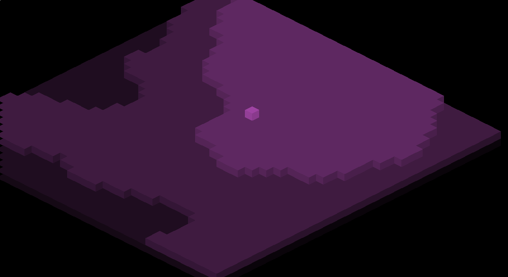

This is a little experiment in learning Clojure and doing isometric graphics using (very simple) procedurally generated sprites.

It uses [Processing.js](http://processingjs.org/) via the [Quil](http://quil.info) bindings.

You can try it out [here](https://alec-deason.github.io/triangle-isometric/index.html). Move with the arrow keys. Reload the page to get new terrain and a new color scheme.

